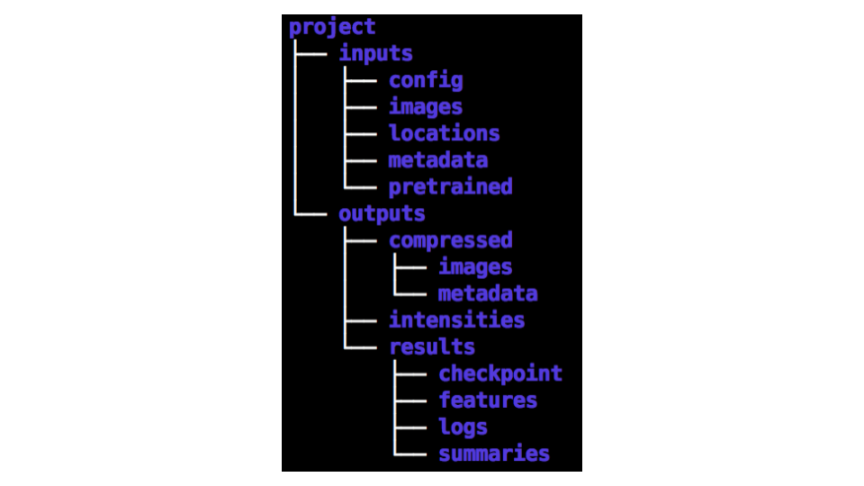

# Home

DeepProfiler aims to use deep learning and representation learning for extracting phenotypic information from microscopy images of cells. This guide describes how to install and run DeepProfiler using the provided example data. After completing this guide, you should have a running version of DeepProfiler, and a general understanding of how to structure your data to use this software, as well as the output that it produces.

**Figure 1.** Flowchart of the inputs and outputs of DeepProfiler.

In a nutshell, DeepProfiler requires three types of input: 1) microscopy images, 2) metadata describing the organization of images in an experiment, and 3) metadata files indicating the locations of single cells in images. Then, DeepProfiler can be run in two modes: 1) training a neural network model that learns to extract features from images, and 2) profiling single cells by running an existing model. The output of DeepProfiler during training is a model file with the learned parameters of a neural network, which can be shared or later reused. During profiling, DeepProfiler creates files with single-cell feature embeddings for the images listed in the metadata file.

What DeepProfiler does not do: 1) it does not identify the location of single cells or segment cells from the images. These locations need to be obtained using other software, such as [CellProfiler](https://cellprofiler.org/) or [Ilastik](https://www.ilastik.org/). 2) DeepProfiler does not create aggregated profiles of cell populations. The single-cell feature embeddings need to be processed separately to perform the corresponding downstream analysis, using tools such as [pycytominer](https://github.com/cytomining/pycytominer). We include a short tutorial for creating aggregated profiles with pycytominer in Section 5.

